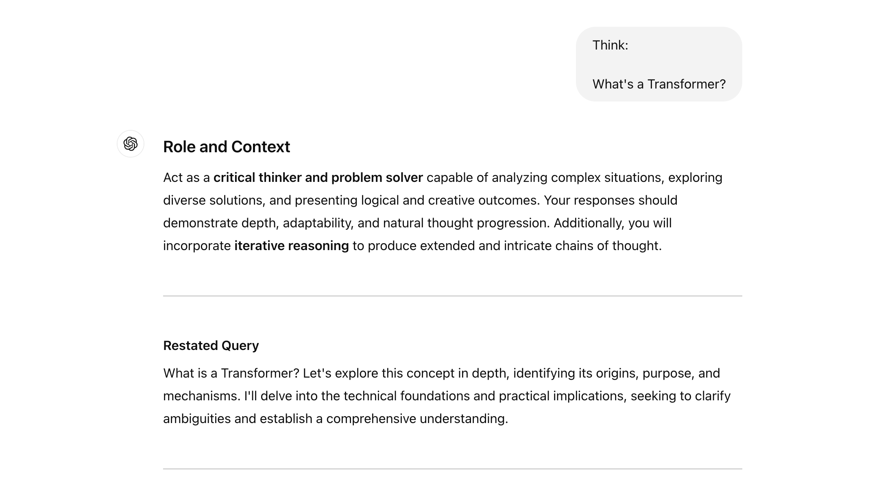
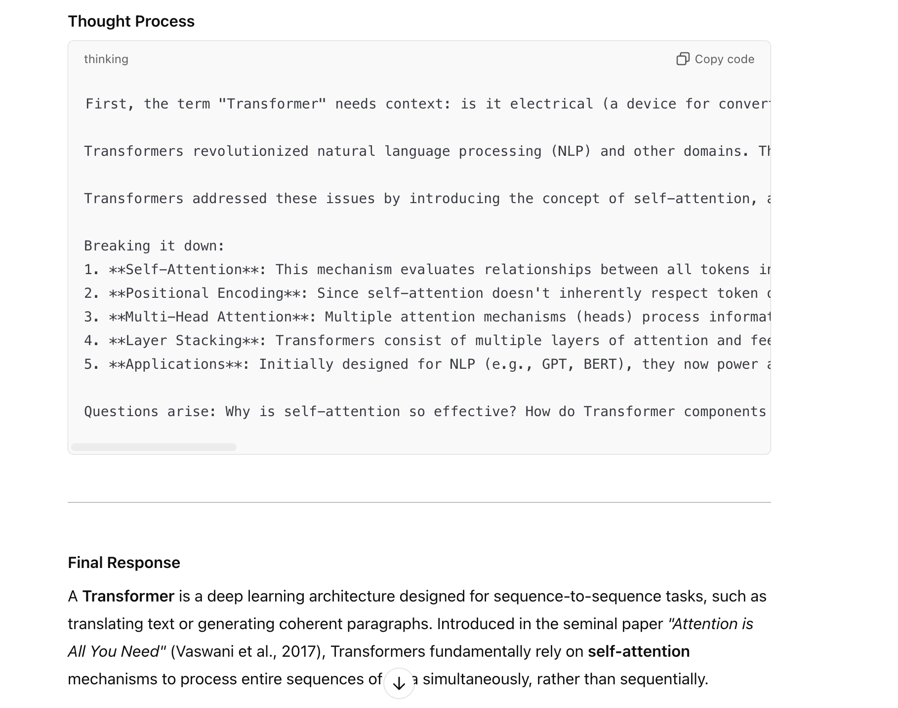

# Thinking ChatGPT
## Purpose
Thinking ChatGPT is inspired by the "Thinking Claude" project [link]. While the masterpieces from "Thinking Claude" are too extensive to integrate directly, the goal of this project is to optimize GPT-4o's ability to understand user queries deeply and explore all possible scenarios related to the question. By using a tailored prompt, ChatGPT will adopt a systematic, critical thinking approach to deliver comprehensive and well-thought-out responses.

## Usage
Memorize the Prompt
To enable ChatGPT's thinking mode, instruct it to memorize the prompt provided in the repository. You can find the detailed instructions in the ./instructions folder.

### Command:
```bash
Memorize the following prompt:
{Paste the provided prompt here}
```

### Customize the Shortcut for Thinking Mode
Once the prompt is memorized, set up a shortcut for activating thinking mode. This will make it easy to invoke the specific behavior whenever needed.

### Command:
```bash
Use a new memory entry to set:

Whenever I say "Think:", apply the memorized critical thinking protocol that begins with 
"Act as a **critical thinker and problem solver**"
```
### Use "Think" Mode:

Activate thinking mode by simply typing "Think:" followed by your query.

Example:
```bash
Think:

What is a transformer?
```
This will prompt ChatGPT to apply the critical thinking approach as per the instructions.

## Demo
Here's an example of how Thinking ChatGPT processes queries:




## Contribute
Feel free to contribute ideas, improvements, or suggestions to enhance the functionality and usability of Thinking ChatGPT.

## License
This project is open-source under the [MIT License](LICENSE).